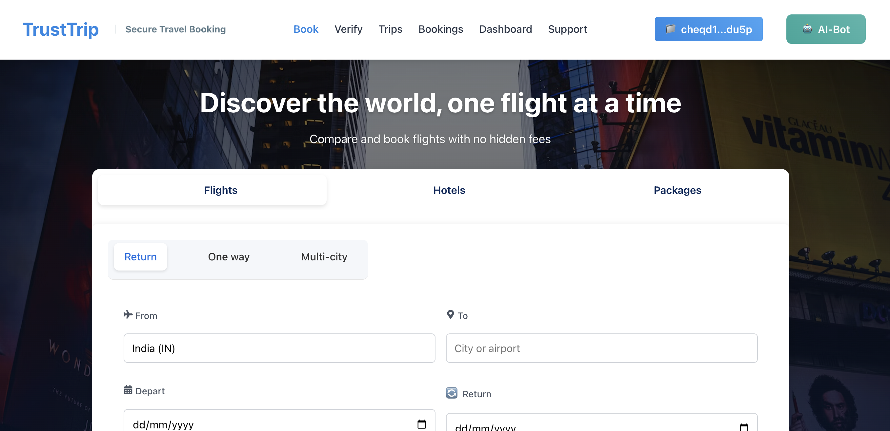

# ✈️ TrustTrip

Welcome to **TrustTrip**, a groundbreaking **decentralized travel booking platform** that leverages **AI** and **verifiable credentials** to revolutionize travel planning. Built on the **cheqd blockchain**, TrustTrip combines secure identity verification, AI-driven booking recommendations, and Web3 technology to empower travelers and providers. Whether you're booking a flight or a hotel, TrustTrip ensures **trust**, **transparency**, and a **seamless experience**. 🚀

🔗 **Live App**: [https://trust-trip.vercel.app/](https://trust-trip.vercel.app/)
🎥 **Demo Video**: [https://youtu.be/C6lUZz2vI4M](https://youtu.be/C6lUZz2vI4M)
💻 **Source Code**: [https://github.com/Anish99594/TrustTrip.git](https://github.com/Anish99594/TrustTrip.git)

This README provides everything you need to understand, deploy, and contribute to TrustTrip. **Let’s travel smarter together!** 💎

## 🌟 Project Overview

TrustTrip is a decentralized travel booking platform that integrates AI with cheqd’s verifiable credentials to create a secure and trusted travel ecosystem. Unlike traditional booking platforms, TrustTrip uses blockchain-based identities (DIDs) and credentials to verify travelers and providers, ensuring authenticity and reducing fraud.

### Key Features

- **Verifiable Credentials**: Securely issued travel bookings as credentials on the cheqd blockchain  
- **AI-Powered Recommendations**: Leverages OpenAI’s GPT-4 for personalized booking suggestions  
- **Decentralized Identity (DID)**: Creates unique DIDs for users and AI agents to enable trusted interactions  
- **Leap Wallet Integration**: Seamless wallet connection for cheqd testnet transactions  
- **Intuitive UI/UX**: A modern React-based frontend with Tailwind CSS for a smooth user experience  

## 🛠️ Technology Stack

### 🧱 System Architecture Overview

**Frontend**: Built with React and Tailwind CSS. Connects to the backend and cheqd blockchain for booking and DID creation  
**Backend**: Node.js with Express handles API requests, DID creation, and OpenAI integration  
**Smart Contracts** *(Future)*: Will implement cheqd-specific transaction logic for advanced credential management  
**cheqd Blockchain**: Manages DIDs and verifiable credentials with low-cost, scalable transactions  
**OpenAI API**: Provides AI-driven travel recommendations  
**Authentication**: API key-based security for backend services and cheqd Studio API  

### Backend

- Node.js & Express  
- cheqd SDK  
- Axios  
- CosmJS  
- OpenAI API  
- Dotenv  

### Frontend

- React  
- Wagmi *(Future)*  
- Tailwind CSS  
- bs58 & uuid  
- Leap Wallet  

### Infrastructure

- cheqd Testnet  
- cheqd Studio API  
- Vite  
- Render *(Optional)*  
- Vercel *(Optional)*  

### Development Tools

- ESLint & Prettier  
- GitHub Actions  
- Hardhat *(Future)*  

## 🚀 Getting Started

### Prerequisites

- Node.js v16 or higher  
- npm or yarn  
- Leap Wallet  
- cheqd Testnet ncheq: [Faucet](https://faucet.cheqd.net)  
- OpenAI API Key  
- cheqd Studio API Key  

### Installation

1. Clone the Repository:

```bash
git clone https://github.com/Anish99594/TrustTrip.git
cd TrustTrip
```

2. Install Backend Dependencies:

```bash
cd backend
npm install
```

3. Install Frontend Dependencies:

```bash
cd ../frontend
npm install
```

4. Configure Environment Variables

In `backend/.env`:

```env
CHEQD_STUDIO_URL=https://studio-api.cheqd.net
CHEQD_STUDIO_API_KEY=your_cheqd_studio_api_key
OPENAI_API_KEY=your_openai_api_key
PORT=3001
```

In `frontend/.env`:

```env
VITE_API_URL=http://localhost:3001
```

5. Run the Backend:

```bash
cd backend
npm start
```

6. Run the Frontend:

```bash
cd ../frontend
npm run dev
```

Open your browser at: `http://localhost:5173`

## 🧪 Testing

### Backend

```bash
cd backend
npm run test
```

### Frontend

```bash
cd frontend
npm run test
```

## 🚢 Deployment

- Backend: Deploy to Render or Heroku (update `VITE_API_URL` in frontend `.env`)  
- Frontend: Deploy to Vercel or Netlify  
- cheqd Mainnet: (Future) Migrate from testnet to mainnet  

## 📖 Usage

### For Travelers

- Connect Leap Wallet to the cheqd testnet  
- Fill in travel details  
- Submit form to receive AI-based booking recommendations  
- Sign DID creation transactions (~500 ncheq each)  
- Receive verifiable booking credential  

### For Providers *(Future)*

- Register DID and become verified provider  
- List services (flights, hotels, tours)  
- Issue verifiable credentials  

## 🔑 Key Interactions

- DID Creation  
- AI Recommendations (via OpenAI)  
- Credential Issuance via cheqd  
- Responsive UI with loading/error states  

## 🌈 Key Features

- Decentralized Identity via cheqd DIDs  
- GPT-4 Travel Planning  
- Blockchain-Backed Credentials  
- Wallet Integration  
- Tailwind CSS + React UI  
- Robust Error Handling  
- Scalable API Backend  

## 🐛 Known Issues & 🔮 Future Enhancements

### Known Issues

- High transaction cost (~1000 ncheq for DIDs)  
- API Rate Limits (OpenAI & cheqd Studio)  
- Delays in Leap Wallet prompt  

### Future Enhancements

- Smart Contract Support  
- Booking Analytics Dashboard  
- Provider Portal  
- Mobile App (React Native)  
- Multi-Chain Support (Cosmos SDK chains)  

## 🤝 Contributing

1. Fork the repo:

```bash
git clone https://github.com/Anish99594/TrustTrip.git
```

2. Create a feature branch:

```bash
git checkout -b feature/your-feature
```

3. Make your changes with tests  
4. Submit a Pull Request

### Contribution Ideas

- Optimize DID creation costs  
- Improve error handling  
- Add new components and animations  
- Increase test coverage  

## 📜 License

Apache-2.0 License. See the `LICENSE` file.

## 🙌 Acknowledgments

- cheqd Team  
- OpenAI  
- Leap Wallet  
- CosmJS  

## 📬 Contact

- 📧 Email: anishgajbhare2000@gmail.com  
- 🐦 Twitter: @TrustTrip
- 💬 Discord: #TrustTrip
- 🐛 GitHub Issues: [Submit here](https://github.com/Anish99594/TrustTrip/issues)  

---

**TrustTrip is more than a travel platform — it’s a movement to bring trust and intelligence to travel planning through decentralization. Join us in shaping the future of travel!** 🌟
